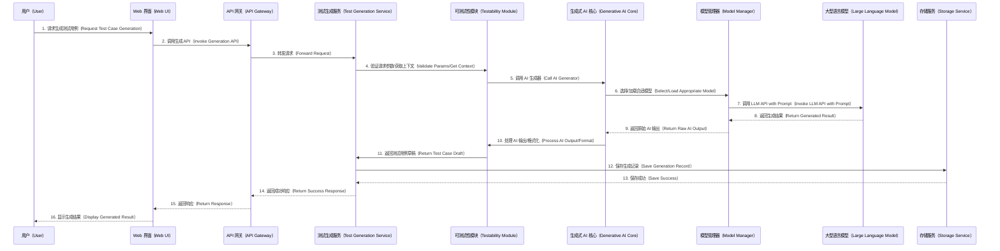

# GenAI4DFX 项目总体架构设计

## 1. 引言

`genai4dfx` 项目旨在构建一个创新性的开源平台，通过系统性地整合 DFX（Design for X）理念与生成式 AI（Generative AI）技术，提升软件系统的性能、安全性、可靠性和可测试性。本架构设计文档将详细阐述项目的核心目标、DFX 领域的问题全景、解决方案全景，并提供详细的架构设计、模块划分和代码蓝图，以确保项目具备高内聚、低耦合、易于维护和扩展的特性。

## 2. DFX 领域问题全景

DFX 是一种前瞻性的设计哲学，要求在产品设计早期就全面考虑产品生命周期中的各种属性（如性能、安全、可靠性、可测试性、可维护性等）。然而，在实际的软件工程实践中，尤其是在复杂的云原生分布式系统中，系统性地应用 DFX 面临诸多挑战：

*   **性能设计（DFP）的滞后性**: 性能问题通常在系统集成测试或生产环境中才暴露，此时修复成本高昂，且难以追溯到早期设计缺陷。缺乏前置的性能建模、预测和自动化评估机制。
*   **安全设计（DFS）的被动性**: 安全往往是事后打补丁，而非从设计之初就融入。在复杂多变的攻击面下，难以确保系统全生命周期的安全性。缺乏主动防御、威胁建模和自动化安全验证能力。
*   **可靠性设计（DFR）的不足**: 分布式系统固有的复杂性使得故障模式多样且难以预测。传统测试方法难以覆盖所有潜在故障场景，导致系统在面对真实故障时表现脆弱。缺乏系统级的容错机制、故障注入演练和自愈能力。
*   **可测试性设计（DFT）的缺失**: 系统设计缺乏可测试性考量，导致测试环境搭建复杂、测试用例编写困难、自动化测试覆盖率低，严重影响了质量保证效率。缺乏易于观测、控制和注入的测试接口。
*   **DFX 知识与实践的碎片化**: 缺乏统一的 DFX 知识体系和工具支撑，导致各团队或项目组各自为政，难以形成规模效应和最佳实践沉淀。
*   **云原生与大数据环境的特殊挑战**: Kubernetes 动态调度、微服务间通信、分布式存储和计算（Doris/ClickHouse/StarRocks）等带来了新的性能瓶颈、安全边界、可靠性挑战和测试复杂性。传统 DFX 方法难以直接适用。
*   **缺乏 AI 赋能**: 当前 DFX 实践多依赖人工经验和手动分析，效率低下且容易遗漏。生成式 AI 在代码分析、模式识别、测试用例生成、故障预测等方面具有巨大潜力，但尚未被充分应用于 DFX 领域。

## 3. 解决方案全景与预期效果

`genai4dfx` 将通过构建一个分层、模块化且高度可扩展的平台来解决上述痛点。我们的解决方案将围绕 DFX 的核心理念，结合生成式 AI 技术，提供一套从设计到运维的全生命周期 DFX 能力支撑。

### 3.1 解决方案全景

本项目的解决方案将重点关注以下几个核心能力构建：

*   **DFX 策略与建模层**: 提供统一的 DFX 策略定义语言和模型，允许用户定义性能 SLO、安全基线、可靠性指标和可测试性要求。这些模型将能够被生成式 AI 辅助生成、验证和优化。
*   **AI 赋能分析与生成层**:
    *   **设计分析**: 基于架构图、代码结构等输入，利用 AI 分析 DFX 属性，识别潜在问题，并提出改进建议。
    *   **测试用例生成**: 根据功能描述、接口定义、代码上下文等，自动生成单元测试、集成测试、性能测试和混沌实验场景。
    *   **优化建议**: 针对性能瓶颈、安全漏洞、可靠性弱点等，提供 AI 驱动的优化配置或代码重构建议。
*   **DFX 运行时支撑层**:
    *   **性能（DFP）**: 集成压测工具（k6）、性能监控（Prometheus）、数据分析（ClickHouse/Doris/StarRocks），提供自动化性能回归和瓶颈诊断。
    *   **安全（DFS）**: 提供安全策略管理（OPA）、运行时安全监控（Falco）、身份认证/授权集成、漏洞扫描集成。
    *   **可靠性（DFR）**: 引入多层级容错模式（多副本、自动故障切换、数据分片冗余），并与混沌工程平台（Chaos Mesh/LitmusChaos）深度融合，实现主动故障注入和韧性验证。
    *   **可测试性（DFT）**: 强调测试接口、健康检查、日志与追踪的标准化，并通过 CI/CD 流水线集成自动化测试和故障注入。
*   **统一可观测性层**: 基于 OpenTelemetry 标准，提供统一的指标、日志和追踪数据采集，结合 Grafana 进行可视化，并利用 AI 进行异常检测和趋势预测。
*   **集成与扩展层**: 提供开放的 API 和插件机制，方便与其他工具（如 CI/CD、代码仓库、监控系统）集成，并支持新中间件或平台能力的扩展。

### 3.2 预期效果全景

通过 `genai4dfx`，我们期望达到以下目标：

*   **提升产品质量**: DFX 在早期阶段的介入，将显著减少后期缺陷，提升软件整体质量，降低缺陷修复成本。
*   **缩短开发周期**: 自动化 DFX 分析、测试和优化，减少人工干预和返工，加速产品迭代和交付。
*   **增强系统韧性**: 通过混沌工程的常态化和 AI 辅助的故障场景演练，系统将具备更强的容错能力和快速恢复能力。
*   **降低运维成本**: 更好的可观测性、自动化故障诊断和自愈机制，将有效降低生产环境的运维压力。
*   **提高市场竞争力**: 具备高性能、高可靠性、高安全性和易于维护的产品将更具市场竞争力。
*   **赋能工程师**: 提供智能化的工具和框架，使工程师能够更高效地进行 DFX 设计和验证，降低 DFX 实践门槛。
*   **沉淀 DFX 知识**: 平台将作为 DFX 最佳实践的载体，促进团队 DFX 知识的沉淀和共享。

## 4. 架构设计

`genai4dfx` 采用典型的分层架构设计，并融合了微服务（Microservices）和领域驱动设计（DDD）的理念，以实现高内聚、低耦合、易于扩展和维护的目标。

### 4.1 核心架构原则

1.  **分层与模块化设计**: 采用清晰的多层架构（展现层、应用层、领域层、基础设施层），确保各组件（模块）易于独立开发、测试、接入和替换。
2.  **借鉴与创新**: 充分吸收并整合所提供“参考开源项目”中的实用特性和优秀设计，并在此基础上进行优化和创新。
3.  **端到端价值导向**: 通过清晰的技术语言（接口定义、核心数据结构、交互流程）明确和阐述整体需求，确保设计能够直接映射到最终用户价值。
4.  **可测试性**: 架构设计高度关注可测试性，确保各模块及整体系统易于进行单元测试、集成测试和端到端测试。
5.  **可观测性（Observability）**: 内建统一的日志、指标、追踪机制，所有关键操作均可被观测。
6.  **可靠性与容错性**: 考虑完善的错误处理机制，定义集中的错误类型和常量，支持多层级容错设计。
7.  **高性能与可伸缩性**: 架构应支持水平扩展和性能优化，通过异步处理、缓存、负载均衡等技术提升系统吞吐量和响应速度。
8.  **安全性**: 从设计之初就考虑安全因素，遵循安全编码规范，实现身份认证、授权、数据加密等机制。
9.  **代码质量与可维护性**: 遵循 Clean Code 原则，确保代码清晰、易懂、易维护。集中定义可枚举类型。
10. **面向接口编程**: 广泛使用接口来定义模块间的契约，降低耦合度，便于替换和测试。

### 4.2 逻辑架构图

下图展示了 `genai4dfx` 的高层逻辑架构，分为核心服务层、接口层、数据层和外部集成层。

```mermaid
graph LR 
    %% Legend for GenAI4DFX Architecture
    %% DFX 层 (DFX Layer) - represents the core DFX capabilities.
    %% GenAI 层 (GenAI Layer) - represents the Generative AI capabilities.
    %% 平台集成层 (Platform Integration Layer) - represents integration with various platforms.
    %% 可观测性层 (Observability Layer) - represents monitoring and logging.
    %% 基础设施层 (Infrastructure Layer) - represents underlying infrastructure services.
    %%
    %% DFX-Core Colors
    %% fill:#82e0aa,stroke:#333,stroke-width:2px,color:#000
    %% GenAI-Core Colors
    %% fill:#a9def9,stroke:#333,stroke-width:2px,color:#000
    %% Integration Colors
    %% fill:#fbd78b,stroke:#333,stroke-width:2px,color:#000
    %% Observability Colors
    %% fill:#c1f0b0,stroke:#333,stroke-width:2px,color:#000
    %% Infra Colors
    %% fill:#d4d4d4,stroke:#333,stroke-width:2px,color:#000


    subgraph UI[用户界面（User Interface）]
        WebUI[Web 界面（Web UI）]
        CLI[命令行工具（CLI Tool）]
    end

    subgraph AS[应用服务层（Application Service Layer）]
        APIGW[API 网关（API Gateway）]
        DFXMgmtSrv[DFX 管理服务（DFX Management Service）]
        DesignAnalSrv[设计分析服务（Design Analysis Service）]
        TestGenSrv[测试生成服务（Test Generation Service）]
        ChaosOrchSrv[混沌编排服务（Chaos Orchestration Service）]
        PerfTestSrv[性能测试服务（Performance Testing Service）]
        SecScanSrv[安全扫描服务（Security Scanning Service）]
    end

    subgraph CL[核心逻辑层（Core Logic Layer）]
        subgraph DFXCL[DFX 核心组件（DFX Core Components）]
            PolicyEngine[DFX 策略引擎（DFX Policy Engine）]
            DFRModule[可靠性模块（Reliability Module）]
            DFTModule[可测试性模块（Testability Module）]
            DFPModule[性能模块（Performance Module）]
            DFSModule[安全模块（Security Module）]
        end

        subgraph GAI[生成式 AI 核心（Generative AI Core）]
            ModelManager[模型管理器（Model Manager）]
            PromptEngine[提示工程（Prompt Engineering）]
            CodeAnalysis[代码分析引擎（Code Analysis Engine）]
            TextGen[文本生成器（Text Generator）]
        end
    end

    subgraph IL[基础设施抽象层（Infrastructure Abstraction Layer）]
        K8sAdapter[Kubernetes 适配器（K8s Adapter）]
        BigDataAdapter[大数据适配器（Big Data Adapter）]
        MiddlewareAdapter[中间件适配器（Middleware Adapter）]
        ObsAdapter[可观测性适配器（Observability Adapter）]
        StorageSvc[存储服务（Storage Service）]
    end

    subgraph ED[外部依赖（External Dependencies）]
        subgraph Ops[运维工具（Operations Tools）]
            Prometheus[Prometheus]
            Grafana[Grafana]
            OpenTelemetry[OpenTelemetry]
            ChaosMesh[Chaos Mesh]
            LitmusChaos[LitmusChaos]
            k6[k6]
            SonarQube[SonarQube]
            Trivy[Trivy]
            OPA[Open Policy Agent]
            Falco[Falco]
        end

        subgraph Platf[目标平台（Target Platforms）]
            Kubernetes[Kubernetes]
            Doris[Apache Doris]
            ClickHouse[ClickHouse]
            StarRocks[StarRocks]
        end

        subgraph MW[中间件（Middleware）]
            Elasticsearch[Elasticsearch]
            Kafka[Apache Kafka]
            Flink[Apache Flink]
            MongoDB[MongoDB]
            Pulsar[Apache Pulsar]
            etcd[etcd]
            Redis[Redis]
            Nginx[Nginx]
        end

        subgraph LLM[大型语言模型（Large Language Models）]
            OpenAIGPT[OpenAI GPT]
            HuggingFace[Hugging Face Models]
            CustomLLM[自定义 LLM（Custom LLM）]
        end
    end

    UI --> APIGW
    APIGW --> DFXMgmtSrv & DesignAnalSrv & TestGenSrv & ChaosOrchSrv & PerfTestSrv & SecScanSrv

    DFXMgmtSrv --> DFXCL
    DesignAnalSrv --> DFXCL & GAI
    TestGenSrv --> DFXCL & GAI
    ChaosOrchSrv --> DFXCL
    PerfTestSrv --> DFXCL
    SecScanSrv --> DFXCL & GAI

    DFXCL --> IL
    GAI --> IL & LLM

    IL --> Ops & Platf & MW & StorageSvc

    ObsAdapter --> Prometheus & OpenTelemetry & Grafana

    ChaosOrchSrv --> ChaosMesh & LitmusChaos
    PerfTestSrv --> k6
    SecScanSrv --> SonarQube & Trivy & OPA & Falco

    StorageSvc --> DB[持久化存储（Persistent Storage）]
````

**逻辑架构说明**：

1. **用户界面层（UI）**: 提供与用户交互的接口，包括基于 Web 的管理控制台和命令行工具（CLI）。
2. **应用服务层（Application Service Layer）**: 封装核心业务逻辑，对外提供 RESTful API 或 gRPC 接口。例如，DFX 管理服务负责策略和配置，设计分析服务利用 AI 评估设计，测试生成服务生成测试用例，混沌编排服务管理混沌实验，性能测试服务执行压测，安全扫描服务进行安全评估。
3. **核心逻辑层（Core Logic Layer）**:

   * **DFX 核心组件（DFX Core Components）**: 实现了各项 DFX 属性的具体逻辑，如 DFX 策略引擎、可靠性增强模块、可测试性框架、性能工具包和安全指导模块。
   * **生成式 AI 核心（Generative AI Core）**: 封装了与外部 LLM 的交互、提示工程、代码分析和文本生成能力，为 DFX 各模块提供 AI 赋能。
4. **基础设施抽象层（Infrastructure Abstraction Layer）**: 提供对底层基础设施的抽象，如 Kubernetes 适配器、大数据平台适配器、中间件适配器、可观测性适配器和持久化存储服务。这一层通过接口隔离具体实现，便于替换和扩展。
5. **外部依赖（External Dependencies）**: 项目所依赖的外部系统和服务，包括：

   * **运维工具**: Prometheus, Grafana, OpenTelemetry, Chaos Mesh, LitmusChaos, k6, SonarQube, Trivy, OPA, Falco 等。
   * **目标平台**: Kubernetes、Apache Doris、ClickHouse、StarRocks 等。
   * **中间件**: Elasticsearch, Kafka, Flink, MongoDB, Pulsar, etcd, Redis, Nginx 等。
   * **大型语言模型（LLM）**: OpenAI GPT, Hugging Face Models, 自定义 LLM 等。

### 4.3 部署架构图

本项目设计为云原生应用，可部署在 Kubernetes 环境中，利用其弹性伸缩、服务发现和自愈能力。

```mermaid
graph LR
    %% Legend for GenAI4DFX Deployment Architecture
    %% 基础设施节点 (Infrastructure Nodes) - represents the underlying server infrastructure.
    %% Kubernetes 控制平面 (Kubernetes Control Plane) - represents the Kubernetes master components.
    %% Kubernetes 工作节点 (Kubernetes Worker Nodes) - represents the nodes running pods.
    %% DFX 应用组件 (DFX Application Components) - represents the microservices of genai4dfx.
    %% 外部依赖服务 (External Dependent Services) - represents services outside genai4dfx but used by it.
    %% Node Colors
    %% fill:#c1f0b0,stroke:#333,stroke-width:2px,color:#000
    %% K8s-CP Colors
    %% fill:#a9def9,stroke:#333,stroke-width:2px,color:#000
    %% K8s-WN Colors
    %% fill:#fbd78b,stroke:#333,stroke-width:2px,color:#000
    %% DFX-App Colors
    %% fill:#82e0aa,stroke:#333,stroke-width:2px,color:#000
    %% External-Dep Colors
    %% fill:#d4d4d4,stroke:#333,stroke-width:2px,color:#000

    subgraph DC1[数据中心 1（Data Center 1）]
        subgraph K8sC1[Kubernetes 集群 1（Kubernetes Cluster 1）]
            subgraph K8sCP1[控制平面（Control Plane）]
                K8sAPI1[API Server]
                K8sSCH1[Scheduler]
                K8sCTRL1[Controller Manager]
                K8sETCD1[etcd 集群]
            end
            subgraph K8sWN1[工作节点组（Worker Nodes）]
                direction LR
                Node1_1[工作节点 N1_1]
                Node1_2[工作节点 N1_2]
                Node1_3[工作节点 N1_3]
            end
        end
    end

    subgraph DC2[数据中心 2（Data Center 2）]
        subgraph K8sC2[Kubernetes 集群 2（Kubernetes Cluster 2）]
            subgraph K8sCP2[控制平面（Control Plane）]
                K8sAPI2[API Server]
                K8sSCH2[Scheduler]
                K8sCTRL2[Controller Manager]
                K8sETCD2[etcd 集群]
            end
            subgraph K8sWN2[工作节点组（Worker Nodes）]
                direction LR
                Node2_1[工作节点 N2_1]
                Node2_2[工作节点 N2_2]
            end
        end
    end

    subgraph GenAI4DFX[genai4dfx 应用部署（genai4dfx Application Deployment）]
        subgraph AppSvcPods[应用服务 Pods（Application Service Pods）]
            GenAI4DFX_UI[UI Pods]
            GenAI4DFX_GW[API Gateway Pods]
            GenAI4DFX_DFX[DFX Management Pods]
            GenAI4DFX_DSG[Design Analysis Pods]
            GenAI4DFX_TEST[Test Generation Pods]
            GenAI4DFX_CHAOS[Chaos Orchestration Pods]
            GenAI4DFX_PERF[Performance Testing Pods]
            GenAI4DFX_SEC[Security Scanning Pods]
        end
        subgraph CoreLogicPods[核心逻辑 Pods（Core Logic Pods）]
            GenAI4DFX_DFXCore[DFX Core Pods]
            GenAI4DFX_GAICore[GenAI Core Pods]
        end
        subgraph InfraAdapterPods[基础设施适配器 Pods（Infra Adapter Pods）]
            GenAI4DFX_K8s[K8s Adapter Pods]
            GenAI4DFX_BigData[Big Data Adapter Pods]
            GenAI4DFX_Middleware[Middleware Adapter Pods]
            GenAI4DFX_Obs[Observability Adapter Pods]
            GenAI4DFX_Storage[Storage Service Pods]
        end
    end

    subgraph External[外部依赖（External Dependencies）]
        subgraph Databases[数据库（Databases）]
            PostgreSQL[PostgreSQL 数据库]
            RedisCache[Redis 缓存]
        end
        subgraph ObsSystem[可观测性系统（Observability System）]
            PrometheusStack[Prometheus Stack]
            GrafanaDashboards[Grafana Dashboards]
            OpenTelemetryCollector[OpenTelemetry Collector]
        end
        subgraph ChaosTools[混沌工程工具（Chaos Engineering Tools）]
            ChaosMeshOperator[Chaos Mesh Operator]
            LitmusChaosOperator[LitmusChaos Operator]
        end
        subgraph OtherTools[其他工具（Other Tools）]
            k6Runner[k6 压测运行器]
            SonarQubeServer[SonarQube Server]
            TrivyScanner[Trivy 扫描器]
        end
        subgraph LLMProviders[大型语言模型提供商（LLM Providers）]
            OpenAIApi[OpenAI API]
            HFModelHub[Hugging Face Model Hub]
        end
        subgraph TargetEnvs[目标测试/生产环境（Target Test/Prod Environments）]
            TargetK8s[目标 Kubernetes 集群]
            TargetBigData[目标大数据平台]
            TargetMiddleware[目标中间件]
        end
    end

    Node1_1 --> AppSvcPods
    Node1_2 --> CoreLogicPods
    Node1_3 --> InfraAdapterPods
    Node2_1 --> AppSvcPods
    Node2_2 --> CoreLogicPods

    GenAI4DFX_Storage --> PostgreSQL & RedisCache
    GenAI4DFX_Obs --> ObsSystem
    GenAI4DFX_CHAOS --> ChaosTools
    GenAI4DFX_PERF --> k6Runner
    GenAI4DFX_SEC --> SonarQubeServer & TrivyScanner
    GenAI4DFX_GAICore --> LLMProviders
    InfraAdapterPods --> TargetEnvs

    K8sAPI1 & K8sAPI2 --> GenAI4DFX_K8s 
    %% Adapter interacts with K8s API
    K8sAPI1 & K8sAPI2 --> ChaosMeshOperator & LitmusChaosOperator 
    %% Chaos tools interact with K8s API
```

**部署架构说明**:

1. **多数据中心/多集群部署**: 为了实现高可用和灾备，`genai4dfx` 应用可部署在多个 Kubernetes 集群中，这些集群可以位于不同的数据中心或可用区。
2. **Kubernetes 平台**: `genai4dfx` 的各个服务将作为 Pod 部署在 Kubernetes 工作节点上。利用 Deployment 进行多副本部署，通过 Service 进行服务发现和负载均衡，通过 Ingress 或 Gateway API 对外暴露服务。
3. **核心服务 Pods**: 逻辑架构中的各个服务（如 DFX 管理服务、设计分析服务等）都将作为独立的微服务 Pod 运行，它们之间通过内部 Service 进行通信。
4. **基础设施**: Kubernetes 节点运行在物理机或虚拟机上，并提供计算、存储和网络资源。
5. **持久化存储**: 项目自身的数据（如 DFX 策略配置、测试报告、元数据等）将存储在外部持久化数据库（如 PostgreSQL）和缓存（如 Redis）中。
6. **可观测性堆栈**: Prometheus 用于指标采集和告警，Grafana 用于数据可视化，OpenTelemetry Collector 用于统一的日志、指标和追踪数据收集。
7. **外部工具集成**: 混沌工程工具（Chaos Mesh, LitmusChaos）、压测工具（k6）、安全扫描工具（SonarQube, Trivy）等将作为独立的组件或服务运行，`genai4dfx` 通过 API 与它们进行交互。
8. **大型语言模型**: LLM 服务可以是云服务（如 OpenAI API）或自部署的模型（如 Hugging Face Model Hub）。
9. **目标环境**: `genai4dfx` 的 DFX 能力验证和增强将作用于目标 Kubernetes 集群、大数据平台和中间件环境。

### 4.4 核心组件时序图（示例：AI 辅助测试用例生成）

以下时序图展示了 AI 辅助生成测试用例的核心流程，体现了应用服务层与核心逻辑层、AI 核心以及外部 LLM 之间的交互。



**时序图说明**：

1. 用户通过 Web 界面发起测试用例生成请求，可能包含代码片段、功能描述或接口定义。
2. 请求通过 API 网关转发到 `TestGenSrv`。
3. `TestGenSrv` 调用 `DFTModule`，`DFTModule` 负责与 `GAICore` 交互。
4. `GAICore` 通过 `ModelManager` 选择并调用适当的外部 LLM（如 OpenAI GPT）。
5. LLM 返回生成的测试用例代码或逻辑草稿。
6. `GAICore` 对 LLM 的原始输出进行后处理和格式化，使其符合 `genai4dfx` 的内部规范。
7. `DFTModule` 接收处理后的测试用例，`TestGenSrv` 将其保存到存储服务并返回给用户。

## 5. 容错与高可用设计

在 `genai4dfx` 项目中，容错与高可用性贯穿于架构的各个层面，旨在确保系统在面对硬件或软件故障时仍能持续提供服务。

### 5.1 多维度容错策略

* **硬件层面**:

  * **网口冗余**: 在服务器层面，通过链路聚合（bond/team）配置多个物理网口，实现网卡故障容忍。
  * **多盘冗余（RAID）**: 采用 RAID 级别（如 RAID 1, RAID 5, RAID 10）保护数据免受单盘或多盘故障影响。
  * **UPS 电源**: 关键服务器和网络设备配置不间断电源（UPS）以应对短暂电力中断。
* **单机层面**:

  * **多实例部署**: 对于无状态服务，在单机上部署多个实例，通过进程守护（如 systemd）或容器运行时（如 Docker）确保其中一个实例故障时能快速拉起新实例或由其他实例接管。
  * **进程健康检查**: 服务内部实现健康检查接口，供外部监控系统（如 Kubernetes readiness/liveness probes）调用，及时发现并隔离异常进程。
* **集群层面**:

  * **多副本机制**:

    * **Kubernetes Pod 多副本**: 通过 Deployment 配置 `replicas` 数量，确保服务的多个 Pod 运行在不同的节点上。Kubernetes 自动进行故障检测和自愈。
    * **数据库多副本**: `Doris/ClickHouse/StarRocks` 自身支持多副本机制，数据写入多份副本以保证高可用和读扩展。
    * **消息队列多副本**: `Kafka/Pulsar` 通过分区和副本机制保证消息不丢失，Broker 故障时 Leader 选举切换。
    * **分布式存储多副本**: `etcd/MongoDB` 采用 Raft/Paxos 协议或 Replica Set 机制保证数据一致性和容灾。
  * **自动故障切换**:

    * **Leader 选举**: 对于有状态服务或协调器角色（如 etcd 的 Leader，Kafka 的 Partition Leader），通过 Leader 选举协议在主节点故障时自动选举新的 Leader。
    * **数据库主备切换**: MySQL/PostgreSQL 等数据库的主备复制和自动化切换工具。
    * **负载均衡器故障转移**: `Nginx` 等负载均衡器可配置健康检查，自动剔除故障后端节点，将流量转发至健康节点。
  * **数据分片与副本机制**: 对大规模数据进行分片（Sharding），每个分片拥有独立的副本集。当某个分片的主节点故障时，其副本可快速接管，且不影响其他分片的可用性。
  * **跨可用区/数据中心部署**: 将应用和服务部署到至少两个不同的可用区或数据中心，以应对整个可用区或数据中心级别的故障。

### 5.2 针对中间件的可靠性增强

* **Kubernetes**:

  * **Master 节点冗余**: 部署多个 Master 节点，并配置高可用（HA）。
  * **etcd 集群**: 部署奇数个 `etcd` 节点（推荐 3 或 5 个），确保大多数节点存活即可提供服务。
  * **调度器和控制器管理器 HA**: 通过 Leader 选举机制确保只有唯一一个实例活跃。
  * **Pod Anti-Affinity**: 配置 Pod 反亲和性，避免同一服务的 Pod 调度到同一节点或可用区。
* **大数据中台（Doris/ClickHouse/StarRocks）**:

  * **FE/Leader 节点 HA**: 部署多个 FE 或 Leader 节点，并通过 Paxos/Raft 协议保证元数据一致性和高可用。
  * **BE/Worker 节点多副本**: 数据写入多个 BE/Worker 节点副本，利用存储自身的副本机制和数据恢复能力。
  * **读写分离/多活架构**: 结合业务需求，设计读写分离或多活架构，提升整体可用性。
* **中间件（ES, Kafka, Flink, MongoDB, Pulsar, etcd, Redis, Nginx）**:

  * **Elasticsearch**: 配置分片和副本机制，启用跨集群复制（CCR）实现异地灾备。
  * **Kafka/Pulsar**: 配置主题的分区和副本数量，ISR（in-sync replicas）机制确保数据持久性。
  * **Flink**: 使用 Checkpoint 和 Savepoints 实现状态一致性和故障恢复，配置高可用 JobManager。
  * **MongoDB**: 部署 Replica Set 模式，配置 Sharding 提升扩展性和容灾。
  * **etcd**: 部署奇数个节点，采用 Raft 协议保证强一致性和容灾。
  * **Redis**: 部署 Cluster 模式实现分片，或使用 Sentinel 机制实现主从切换。
  * **Nginx**: 部署多台 Nginx 实例，前端通过 DNS 轮询或 Keepalived + VRRP 实现高可用。

## 6. 混沌工程与测试演练

混沌工程是验证系统韧性的关键手段，通过主动注入故障来发现系统潜在弱点。`genai4dfx` 将深度集成混沌工程能力。

### 6.1 混沌工程平台集成

* **Chaos Mesh**: 作为 Kubernetes 原生混沌工程平台，可用于注入 Pod 故障（删除、重启）、网络故障（延迟、丢包）、压力注入（CPU、内存、I/O）等。`genai4dfx` 将提供友好的界面和 API 来编排 Chaos Mesh 实验。
* **LitmusChaos**: 另一个强大的开源混沌工程平台，提供丰富的混沌实验库。`genai4dfx` 将支持 LitmusChaos 的集成和管理。

### 6.2 演练能力与方案

* **场景库构建**: 基于业务场景和历史故障分析，构建可复用的混沌实验场景库。例如：

  * **网络故障**: 模拟 Pod 间网络延迟、DNS 故障、特定 IP 流量丢弃。
  * **资源饱和**: 注入 CPU/内存/I/O 压力，观察系统降级、限流、自愈情况。
  * **进程/Pod 故障**: 随机杀掉核心服务的 Pod、重启容器。
  * **节点故障**: 模拟 Kubernetes 工作节点宕机、网络分区。
  * **中间件故障**: 模拟 Kafka Broker 掉线、数据库主从切换失败、Redis 节点宕机。
  * **数据故障**: 模拟数据不一致、数据损坏（需谨慎在非生产环境进行）。
* **AI 辅助场景生成与优化**:

  * 利用生成式 AI 根据系统架构、依赖关系和历史故障数据，智能推荐或生成更复杂、更真实的混沌实验场景。
  * 分析混沌实验结果，通过 AI 识别异常模式，提出改进建议。
* **自动化与常态化**:

  * 将混沌实验集成到 CI/CD 流水线中，实现自动化运行和报告生成。
  * 在非生产环境（如 staging 环境）常态化运行混沌实验，提前发现问题。
* **度量与观测**:

  * 结合 Prometheus、OpenTelemetry 收集混沌实验过程中的各项指标（错误率、延迟、吞吐量、资源利用率等）。
  * 通过 Grafana 仪表板实时展示实验效果，评估系统韧性。
* **预案与恢复**:

  * 针对混沌实验中发现的问题，及时完善应急预案，并进行恢复演练。
  * 将预案的有效性纳入混沌实验的验证范围。

## 7. 项目目录结构与代码生成蓝图

遵循标准的 Golang 项目结构，确保项目的可读性、可维护性和可扩展性。

```
.
├── cmd                         # 主程序入口
│   └── genai4dfx               # genai4dfx 主程序入口
│       └── main.go             # 核心应用程序启动文件
├── config                      # 配置文件
│   └── default.yaml            # 默认配置
│   └── config.go               # 配置加载和管理
├── internal                    # 内部核心业务逻辑，不应被外部直接引用
│   ├── app                     # 应用服务层，协调领域服务和基础设施服务，处理用例
│   │   ├── services            # 应用服务接口定义
│   │   │   ├── dsp             # 设计分析服务
│   │   │   │   └── service.go
│   │   │   ├── chaos           # 混沌编排服务
│   │   │   │   └── service.go
│   │   │   ├── dpm             # 性能测试服务
│   │   │   │   └── service.go
│   │   │   ├── sec             # 安全扫描服务
│   │   │   │   └── service.go
│   │   │   ├── dfx             # DFX 管理服务 (策略、配置)
│   │   │   │   └── service.go
│   │   │   └── testgen         # 测试生成服务
│   │   │       └── service.go
│   │   └── handlers            # API 请求处理，调用应用服务
│   │       └── http            # HTTP 接口处理
│   │           └── handler.go
│   │           └── routes.go
│   ├── core                    # 领域层，定义核心业务模型和逻辑，不依赖基础设施
│   │   ├── domain              # 领域模型
│   │   │   ├── dsp             # 设计分析领域对象
│   │   │   │   └── model.go
│   │   │   ├── chaos           # 混沌实验领域对象
│   │   │   │   └── model.go
│   │   │   ├── dpm             # 性能测试领域对象
│   │   │   │   └── model.go
│   │   │   ├── sec             # 安全领域对象
│   │   │   │   └── model.go
│   │   │   ├── dfx             # DFX 策略和元数据领域对象
│   │   │   │   └── model.go
│   │   │   └── testgen         # 测试用例生成领域对象
│   │   │       └── model.go
│   │   └── ports               # 领域服务接口（端口），由应用服务调用，由基础设施层实现
│   │       ├── dsp             # 设计分析服务接口
│   │       │   └── repository.go
│   │       ├── chaos           # 混沌编排服务接口
│   │       │   └── orchestrator.go
│   │       ├── dpm             # 性能测试服务接口
│   │       │   └── client.go
│   │       ├── sec             # 安全扫描服务接口
│   │       │   └── scanner.go
│   │       ├── dfx             # DFX 策略存储接口
│   │       │   └── repository.go
│   │       └── testgen         # 测试生成器接口
│   │           └── generator.go
│   ├── infra                   # 基础设施层，实现领域层定义的接口，处理外部依赖
│   │   ├── persistence         # 数据持久化实现
│   │   │   ├── postgres        # PostgreSQL 存储实现
│   │   │   │   └── repository.go
│   │   │   └── redis           # Redis 缓存实现
│   │   │       └── cache.go
│   │   ├── adapters            # 外部服务适配器实现
│   │   │   ├── k8s             # Kubernetes API 适配器
│   │   │   │   └── adapter.go
│   │   │   ├── bigdata         # 大数据平台适配器（Doris/ClickHouse/StarRocks）
│   │   │   │   └── adapter.go
│   │   │   ├── middleware      # 中间件通用适配器（Kafka, ES, Flink等）
│   │   │   │   └── adapter.go
│   │   │   ├── chaos           # 混沌工程工具适配器（Chaos Mesh, LitmusChaos）
│   │   │   │   └── adapter.go
│   │   │   ├── perf            # 性能测试工具适配器（k6）
│   │   │   │   └── adapter.go
│   │   │   ├── sec             # 安全工具适配器（SonarQube, Trivy, OPA）
│   │   │   │   └── adapter.go
│   │   │   └── llm             # 大型语言模型适配器（OpenAI, HuggingFace）
│   │   │       └── adapter.go
│   │   └── telemetry           # 可观测性实现（日志、指标、追踪）
│   │       └── otel            # OpenTelemetry 实现
│   │           ├── logger.go
│   │           ├── metrics.go
│   │           └── tracer.go
│   │       └── logging.go      # 统一日志接口实现
│   ├── common                  # 跨模块共享的通用工具、类型、常量等
│   │   ├── constants           # 全局常量定义
│   │   │   └── constants.go
│   │   ├── errors              # 集中错误类型和错误码定义
│   │   │   └── errors.go
│   │   ├── types               # 共享数据类型（DTOs, Models）
│   │   │   ├── dto.go
│   │   │   └── enum            # 枚举类型
│   │   │       └── enum.go
│   │   ├── utils               # 通用工具函数
│   │   │   └── utils.go
│   │   └── validation          # 通用校验器
│   │       └── validator.go
│   └── boot                    # 应用启动引导，依赖注入，服务注册
│       └── wire.go             # Wire 依赖注入文件 (或手动DI)
│       └── app.go              # 应用初始化和启动
├── pkg                         # 公共库，可被外部项目安全引用
│   └── client                  # 对外暴露的 SDK/客户端
│       └── client.go
├── docs                        # 文档
│   ├── architecture.md         # 架构设计文档 (当前文件)
│   └── api                     # API 文档
│       └── openapi.yaml
├── scripts                     # 辅助脚本
│   └── setup.sh                # 环境设置脚本
│   └── deploy.sh               # 部署脚本
├── tests                       # 端到端测试
│   └── e2e                     # 端到端测试
│       └── suite_test.go
├── vendor                      # Go Modules 依赖 (如果使用 vendor 模式)
├── .gitignore
├── go.mod
├── go.sum
└── README.md
└── README-zh.md
```

## 参考资料

- \[1] [codefuse-ai/Awesome-Code-LLM](https://github.com/codefuse-ai/Awesome-Code-LLM)
- \[2] [DfX-NYUAD/GNN4IC](https://github.com/DfX-NYUAD/GNN4IC)
- \[3] [sdfxai/sdfx](https://github.com/sdfxai/sdfx)
- \[4] [Go Project Layout (Standard Go Project Layout)](https://github.com/golang-standards/project-layout)
- \[5] [Clean Code (Robert C. Martin)](https://www.amazon.com/Clean-Code-Handbook-Software-Craftsmanship/dp/0132350882)
- \[6] [Domain-Driven Design (Eric Evans)](https://www.amazon.com/Domain-Driven-Design-Tackling-Complexity-Software/dp/0321125215)
- \[7] [Mermaid Syntax (Mermaid.js Official Documentation)](https://mermaid.js.org/syntax/flowchart.html)